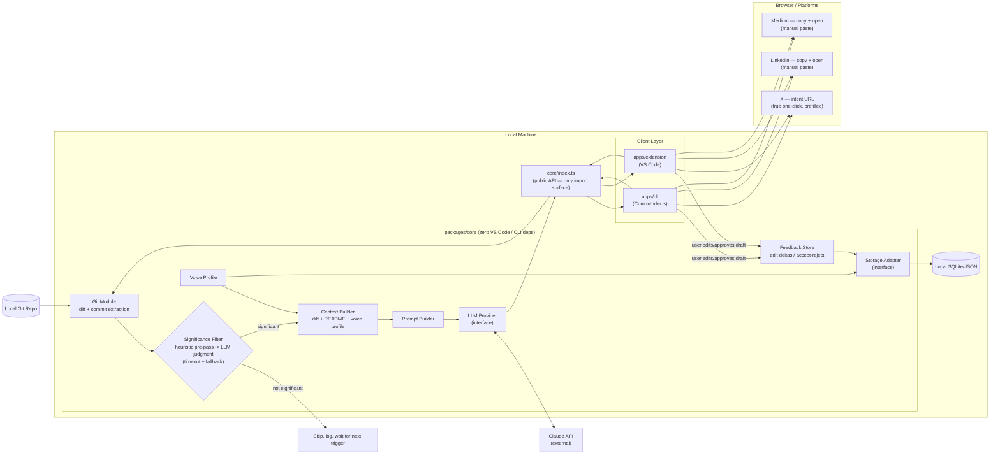

# Tract

CLI that turns your git commits into ready-to-post content — blog, X, LinkedIn, YouTube script — in your own voice.

Early WIP, first commit. Nothing to install yet.

See `PRD.md` for full context.
