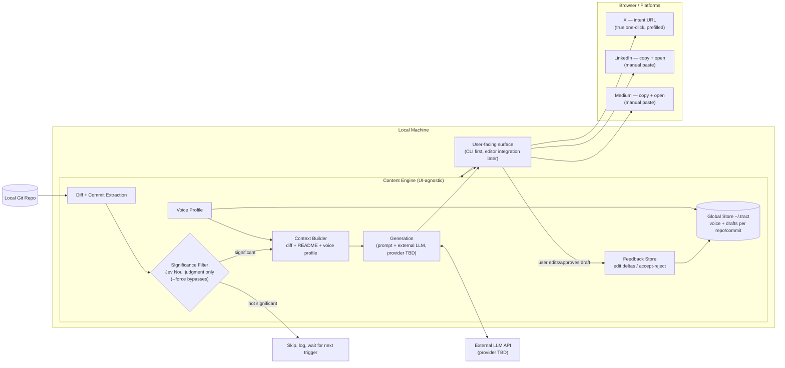

# Tract

Turns your git commits into ready-to-post content — blog, X, LinkedIn (YouTube script deferred to post-v1) — in your own voice.

Early WIP, first commit. Nothing to install yet.

See `PRD.md` for full context.
